# Installation

The following contains everything you need to know to install Python and all relevant packages on your computer, access online computing resources and run jupyter notebooks. Please read it carefully before approaching us with questions.

We describe one way of doing things that works. Sometimes there are alternative ways (e.g. using a different shell, using a graphical interface instead of a shell, ...). If you know what you are doing, feel free to do things differently but be aware that we do not provide help if you run into problems in that case.


## In JupyterHub

JupyterHub lets you access a jupyter notebook online. All packages you need are already installed. You can start writing code right away.

The only donwside of JupyterHub is that the computing resources, disk space and memory are very. Your laptop or google colab notebooks might be faster and give you more space (i.e. you can work with larger models or have to clear the cache less often).

You can start JupyterHub from ecampus. To do so, navigate to the course on ecampus and click on the JupyterHub button

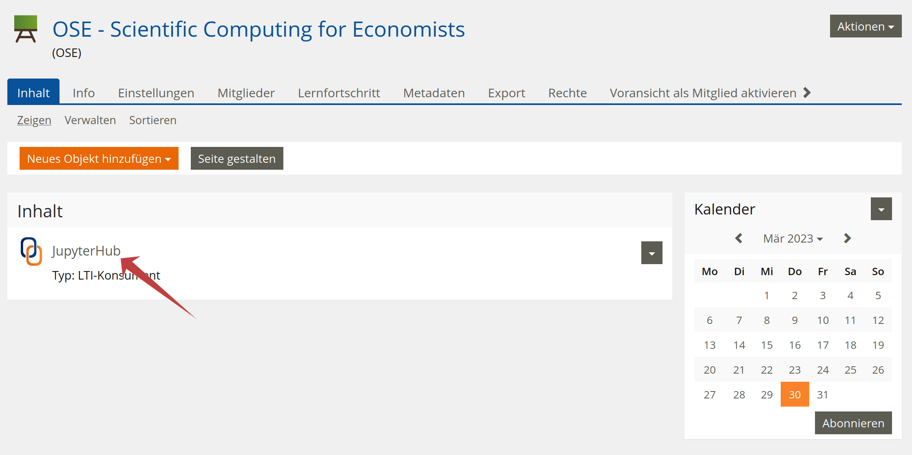

Click on "start"

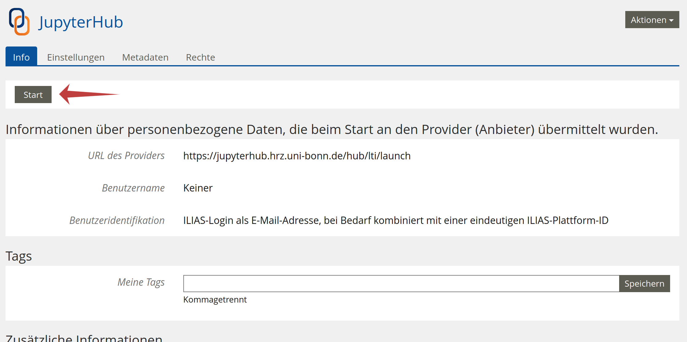

Click on "start my server" and wait. This can take a while. Do not reload the page.

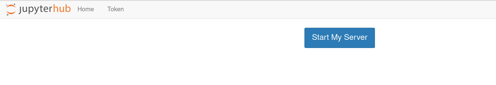

You can click on the top tile ("Notebook - Python 3") to start a fresh notebook.
You can also drag and drop a notebook from your computer to the left sidebar and open it
by double-clicking on it.

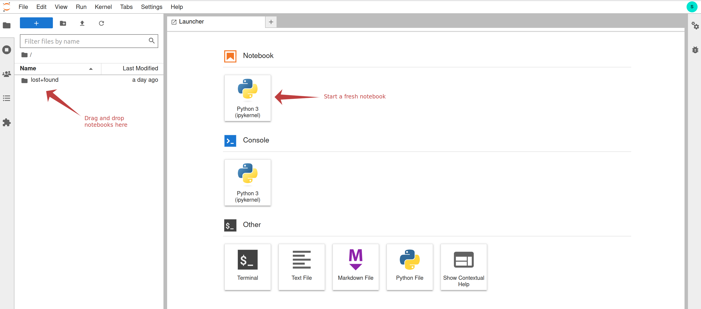

One the notebook is open, you can add your python code:

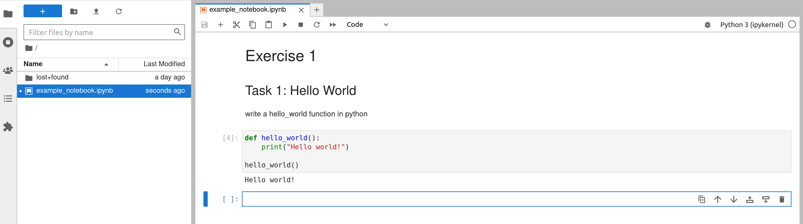

When you are done, you can download the notebook and use it on a different computer:

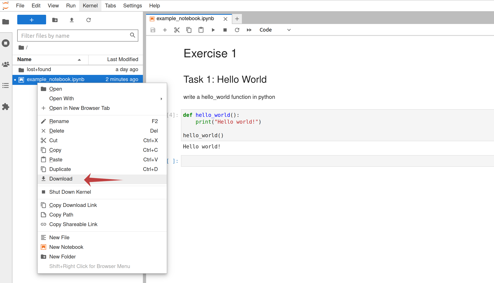


## On your computer

Your own computer is usually the most convenient place to run code and in most cases it is more powerful than what you get on JupyterHub. However, you have to install Python there and create and activate a conda environment.

### Get Anaconda


First, go to the [anaconda webpage](https://www.anaconda.com/products/distribution) and download the installer.


Next, follow the [installation instructions](https://docs.anaconda.com/anaconda/install/index.html) for your operating system. Go with the recommended defaults in all cases.


### Create the environment

Download the environment file for your operating system. You can choose where you save it.

```{eval-rst}
:download:`windows <_static/environment_windows.yml>`
:download:`mac and linux <_static/environment.yml>`
```

Open a Terminal (on windows, use the Anaconda Prompt that comes with Anaconda) in the folder in which you stored the environment file.

Run the command

```bash
conda env create -f environment.yml
```

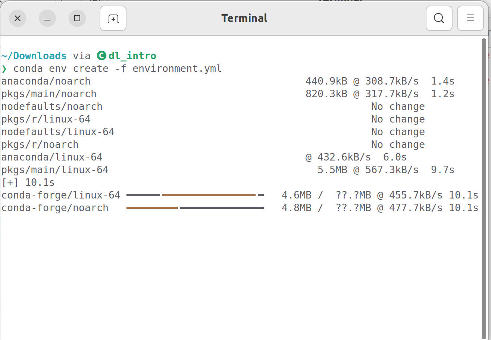

If your environment file is called differently (e.g. `environment_windows.yml`) you need to adjust the command (e.g. to `conda env create -f environment_windows.yml`).

This will take a while and the terminal output you get differs across different computers.

You only have to do this once for the entire course.

### Opening a notebook

There are many ways to open a notebook. Some do not involve a terminal. Use them if you know what you are doing, but do what we write below if you are new:

Open a terminal (on windows use the Anaconda Prompt that comes with Anaconda) in the folder in which your notebook is stored or in the folder in which you want to store a new notebook. This can be any folder and it does not need to contain the environment file from the pervios step.

Run the following commands:

```bash
conda activate dl_intro
```
`dl_intro` is the name of the environment you created in the previous step. The environment name is not the same as the name of the `.yml` file.

```bash
jupyter notebook
```

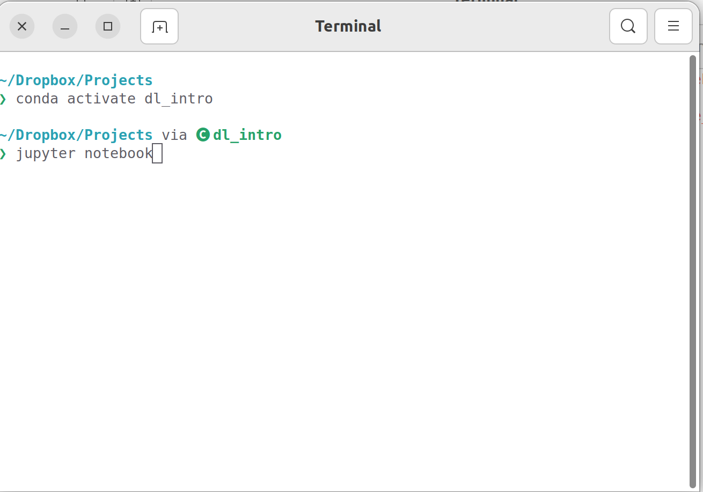

This will open a tab with the notebook in your browser. Moreover, it will print cryptic messages to your terminal. You do not need to understand them but you cannot close the terminal. Otherwise your notebook shuts down as well.

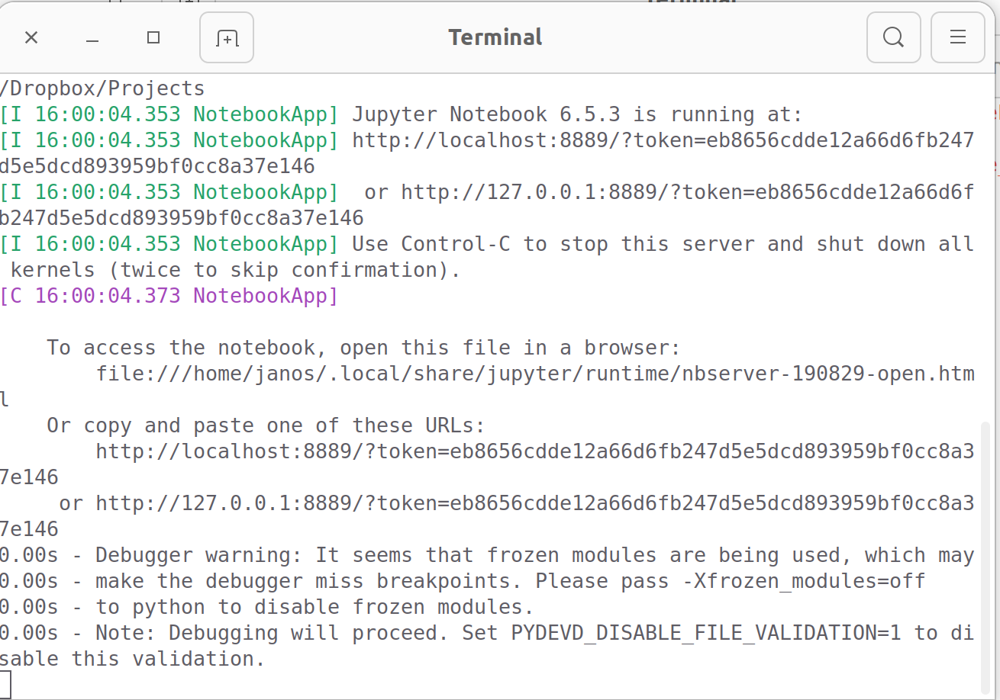

On the start screen you can open existing notebooks or create new ones.

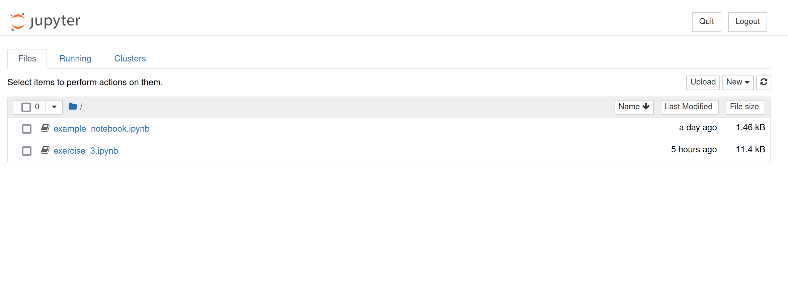

Once you opened a notebook, it is the same as on jupyterhub.

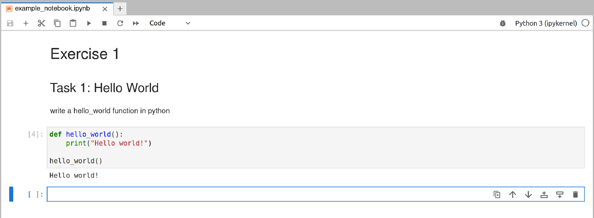


## On Google Colab

to be written
